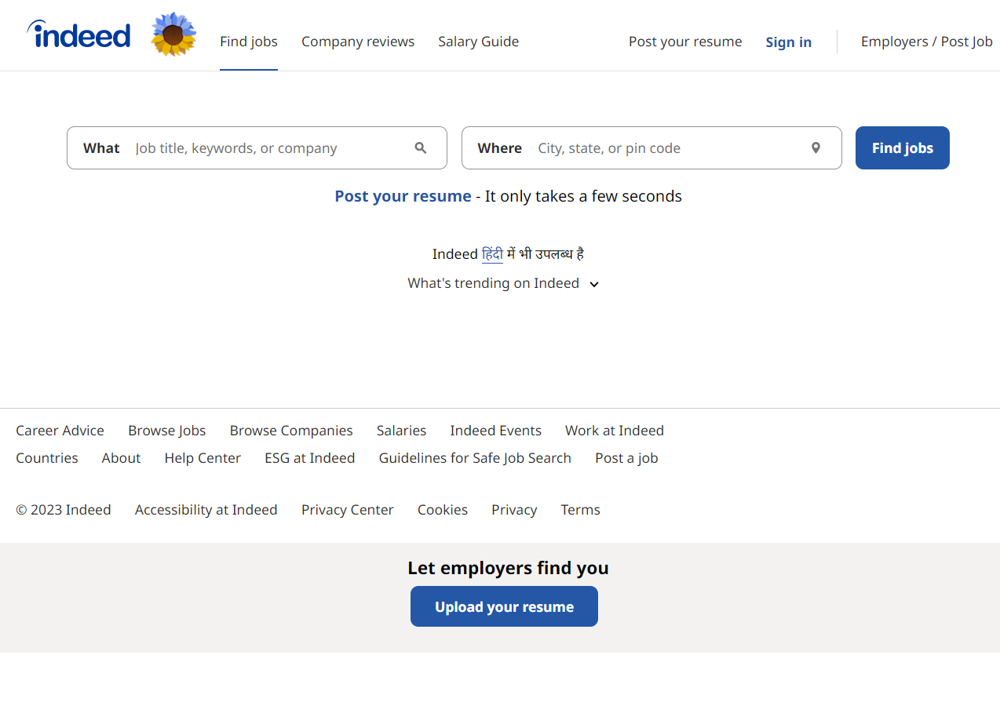
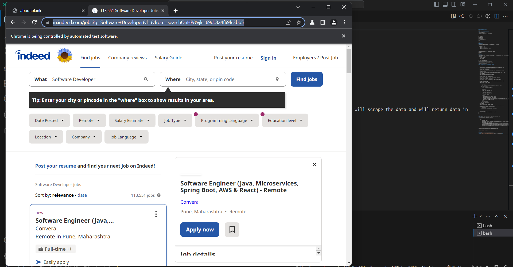

# Web Scraper for Job Listings

<br>

## What we will use and what we can do ?
- We will use puppeteer
- Some extra module like puppeteer-extra
- We can scrape job data from job listing websites
- We can make JSON or CSV file and store data inside it

## Getting Started

```
npm i puppeteer
# or using yarn
yarn add puppeteer
# or using pnpm
pnpm i puppeteer
// For extra functionality
npm i puppeteer-extra
# and
npm i puppeteer-extra-plugin-stealth
```

<br>

## Dependencies
- These dependencies we will be need during this project
- We can ignore nodemon instead of we can just change start key in script tag

```
"dependencies": {
    "nodemon": "^2.0.22",
    "puppeteer": "^19.11.1",
    "puppeteer-extra": "^3.3.6",
    "puppeteer-extra-plugin-stealth": "^2.11.2"
  }
```
<br>

## Installing browser and page
- Every function will be async function and will take some time
- We have to use async await and try catch block
- To launch browser and web page we need this . 
- Inside main function we have launch it .
```
async function main(){
    try{
        const browser = await puppeteer.launch();
        const page = await browser.newPage();
    }catch(err){
        console.log(err)
    }
}
 
```

## Run the scrapper
- We can use terminal for run the scrapper with this command
```
node index.js
```
<br>

## Input query
- For scrapping particular job profile we have to just pass job title in function and then it will scrape the data and will return data in json format
- Search query can be like 
  - Software Developer
  - Full stack developer
  - data analyst
  - backend developer
- You can refer this code snippet

```
let query = "software Developer"

scrapeJobListings(query, "https://in.indeed.com/");
```  
- So you have to pass your query inside this function
- Remaining work will do function
- This is for particular indeed job listing website

## When call this function it will run something like that

```
async function scrapeJobListings(searchQuery, url) {
	try {

    //to launch browser we have launch inbuild method that we will use here and pass some keys
    const browser = await puppeteer.launch({ headless: false });

    //This will create new page for us
    const page = await browser.newPage();

    // this url of website that we will provide in this case we have specific website of indeed
    const pageUrl = `${url}`;

    //this inbuild goto method will make us to jump on perticular website and will scrape the data
    await page.goto(pageUrl);
    console.log(pageUrl);

    //If we want to take screenshot of particular web page
    await page.screenshot({ path: "image.png", fullPage: true });

    //If we want to create pdf of particular page
    await page.pdf({ path: "image.pdf", formate:"A4"});

    // here query will pass that user can change according to their need of data
    await page.type("#text-input-what", searchQuery);

    //this click event will click on submit button after input fulfilled in input box
    await page.click("[type=submit]");

    //this timeout will give us time break meanwhile data will be scraped and we will get output
    await page.waitForTimeout(5000);

    //this will return us scraped data array
    const jobs = await page.evaluate(() => {

        let jobListings = [];

        let myData = document.querySelectorAll("#mosaic-provider-jobcards > ul > li");

        myData.forEach((el, index) => {

            let data = el.innerText.trim().split("\n");
            let count = 1;

            let part1 = "";
            let part2 = "";
            let part3 = "";
            for (let i = 4; i < data.length; i++) {
                part1 = part1 + data[i] + ".!";
            }
            for (let i = 3; i < data.length; i++) {
                part2 = part2 + data[i] + ".!";
            }
            for (let i = 6; i < data.length; i++) {
                part3 = part3 + data[6]+ ".!";
            }
            let myObj = {
                JobTitle: data[0],
                companyName: data[1] == "new" ? data[2] : data[1],
                Location: data[1] == "new" ? data[3] : data[2],
                JobDescription: data[1] == "new" ? part1 : part2,
                jobPostingTime: data[1] == "new" ? data[7]:data[6],
                url: document.querySelector(`#mosaic-provider-jobcards > ul > li:nth-child(${count}) > div > div.slider_container.css-77eoo7.eu4oa1w0 > div > div.slider_item.css-kyg8or.eu4oa1w0 > div > table.jobCard_mainContent.big6_visualChanges > tbody > tr > td > div.css-1m4cuuf.e37uo190 > h2 > a`).href,
            };
            count++;
            jobListings.push(myObj);
        });
        return { "jobs": jobListings };
    })
    console.log(jobs)

    //this will close the browser after data scrapped
    await browser.close();

    //this is node inbuild file system will provide us new json file in the form of data array
    fs.writeFile("jobList.json", JSON.stringify(jobs), (err) => {
        if (err) {
            console.log(err);
        } else {
            console.log("JSON file created, all data will be there.");
        }
    });

} catch (err) {
    await browser.close();
    console.log("Could not create a browser instance => : ", err);
}

}
```

<br>

## JSON data
- Here is one data example that will have in JSON file after creating JSON file
- It wil contain Job tile, company name, location etc.
- You can see this example data

```
       {
            "JobTitle": "Software Engineer II - Frontend",
            "companyName": "Uber3.5",
            "Location": "Bengaluru, Karnataka",
            "JobDescription": "Full-time.!Work on Uber's most complex web applications by designing, implementing, and unit testing the frontend application code..!Posted.!Posted 12 days ago.!",
            "jobPostingTime": "Posted 12 days ago",
            "url": "https://in.indeed.com/pagead/clk?mo=r&ad=-6NYlbfkN0BAHxQa-UPLtW7JK8D3QhfYrNbwRzYIBTTzoKwy8XmBQoJqPF-jJEvxEqIeGg0nSus--EZlpGbAFtFq2GGk26M74Dkwa7USlLxZ9989TX4Nc-1qzN2Q7NFzehJ-iXQjjwitUIfc4zhHNEEGJP9hHLaaGe0Alq7u03EqazWoBUC3g8NgNFZwgTY7JdJelP4ZRrFx-8Kmw9PDI1kk1EX_bxVvnaDhvKFeiimEIXkDKMNFzh4gOD20eWaLNPSZE8DN7AoF-hRDEv83HhJBL_lyCjagWd-QKnCyGW9MNruQQgF2YfThb2PfLm3UJCoFiHWnX6FlL-IZexAqpWRXCDUU5OL4kvMQj7gz4TP5QhlLV2c3R0l-IihZtibN5HactSIxlua8F276t52GPvysWBIQOq5pgdXuir_wo0yMqQ-fKENurBtUWuvao_b7YQ7kKQFiO9BxCp_RnRTG5x0tsE6aBMltF5Wucp9zCVuNjfal-4HoibH6ozJauYiYAlhrgsh0a7-YHghScRjLGxuNkrbQ_qHdZY1zWU2z5wc=&xkcb=SoCO-_M3QrQvp52ygZ0LbzkdCdPP&p=0&fvj=1&vjs=3"
        }
```

## Screenshot
- We can also create screenshot of particular webpage that we want scrape
- here is one screenshot you can see



- When user will give query then how it will redirect and scrape the data in website



<br>


## References
- <a href="https://pptr.dev/">Puppeteer Documentation</a>
- <a href="https://www.npmjs.com/package/puppeteer-extra">Puppeteer-extra Documentation</a>
- <a href="https://www.npmjs.com/package/puppeteer-extra-plugin-stealth">Puppeteer-extra-plugin-stealth Documentation</a>


